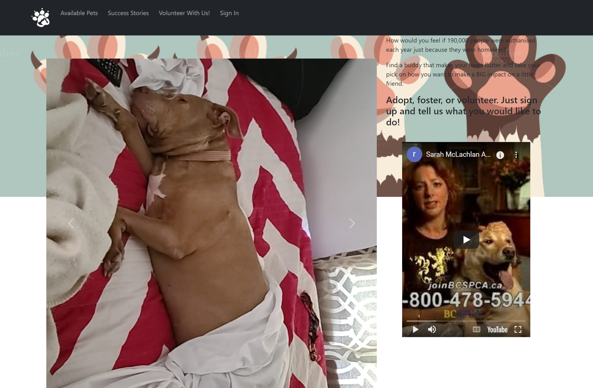
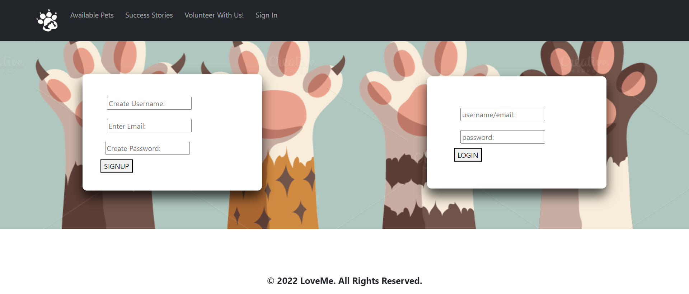
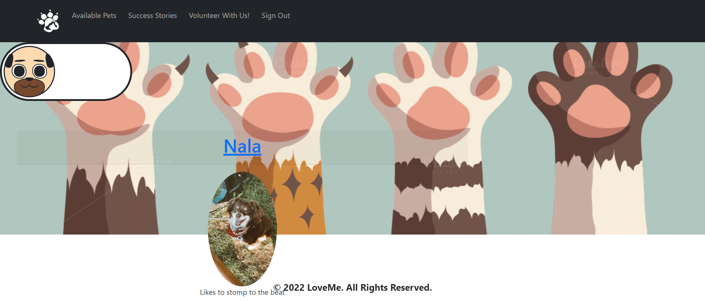
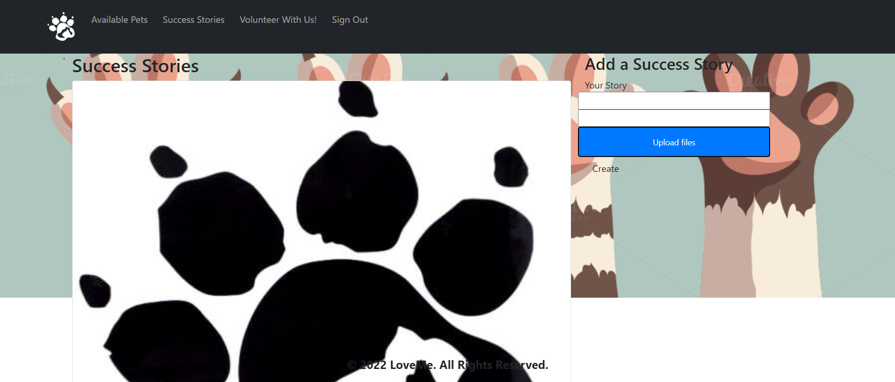

# Love Me

## Description

Through the use of node js and express to create a RESTful API using Handlebars as the template engine and MYSQL and sequelize ORM for the database. We demonstrated the use of routes to get and retrieve data. Also use them to display data on the page.

The site is deployed to heroku on with data and has a polished UI. The site is mobile friendly and uses the bcrypt to encrypt the passwords.

## Table of Contents

- [Installation](#installation)
- [Usage](#usage)
- [Credits](#credits)
- [License](#license)

## Installation

Run

```text
git clone https://github.com/cthomas265/Love-Me.git
```

```text
npm run seed
```

```text
npm start
```
go to

```text
http://localhost:3001
```
for deployed link on heroku

```text
https://damp-hamlet-43644.herokuapp.com/
```

## Usage

The front page has a main menu bar with 4 options:
    see pets
    see stories
    see volunteers
    login or register



you can choice to register or login


You can toggle the dogs or cats


You can view and create stories once logged in



## Credits

James 
Carrie
Michael
Sajid

## License
MIT License

Copyright (c) [2022]

Permission is hereby granted, free of charge, to any person obtaining a copy
of this software and associated documentation files (the "Software"), to deal
in the Software without restriction, including without limitation the rights
to use, copy, modify, merge, publish, distribute, sublicense, and/or sell
copies of the Software, and to permit persons to whom the Software is
furnished to do so, subject to the following conditions:

The above copyright notice and this permission notice shall be included in all
copies or substantial portions of the Software.

THE SOFTWARE IS PROVIDED "AS IS", WITHOUT WARRANTY OF ANY KIND, EXPRESS OR
IMPLIED, INCLUDING BUT NOT LIMITED TO THE WARRANTIES OF MERCHANTABILITY,
FITNESS FOR A PARTICULAR PURPOSE AND NONINFRINGEMENT. IN NO EVENT SHALL THE
AUTHORS OR COPYRIGHT HOLDERS BE LIABLE FOR ANY CLAIM, DAMAGES OR OTHER
LIABILITY, WHETHER IN AN ACTION OF CONTRACT, TORT OR OTHERWISE, ARISING FROM,
OUT OF OR IN CONNECTION WITH THE SOFTWARE OR THE USE OR OTHER DEALINGS IN THE
SOFTWARE.

## Badges


Badges aren't necessary, per se, but they demonstrate street cred. Badges let other developers know that you know what you're doing. Check out the badges hosted by [shields.io](https://shields.io/). You may not understand what they all represent now, but you will in time.
